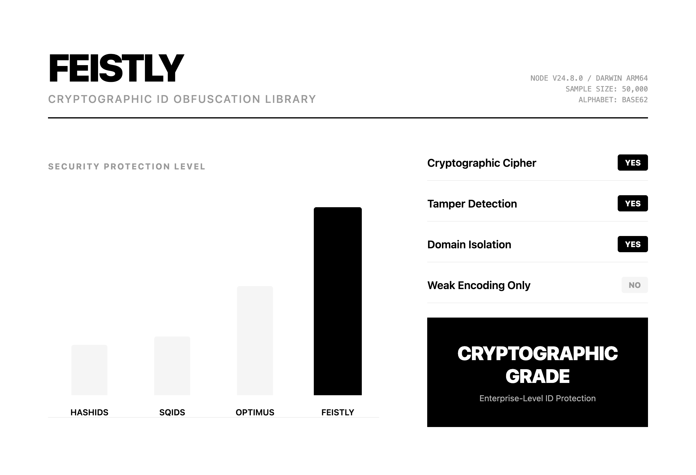

# Feistly

<div align="center">



**🔒 Cryptographically secure ID obfuscation that doesn't compromise**

Transform predictable auto-increment IDs into tamper-resistant tokens without changing your database schema.

[](https://www.npmjs.com/package/feistly)
[](https://opensource.org/licenses/MIT)
[](https://www.typescriptlang.org/)

[Quick Start](#quick-start) • [Benchmarks](#benchmarks) • [API](#api-reference) • [Security](#security-considerations)

</div>

---

## The Problem

```ts
// ❌ Your URLs leak business metrics
https://api.example.com/users/12345    // Competitors know you have ~12K users
https://api.example.com/orders/891     // Only 891 orders? Not impressive.

// ❌ Sequential IDs enable enumeration attacks
for (let i = 1; i < 10000; i++) {
  fetch(`/api/users/${i}`)  // Scrape all user data
}
```

## The Solution

```ts
import { Feistly } from "feistly";

const feistly = new Feistly({
  masterKey: process.env.FEISTLY_MASTER_KEY!
});

// ✅ Same ID, always the same token (deterministic)
const token = feistly.encrypt("user", 12345);
// → "7nX4kP2mQ"

// ✅ Cryptographically obfuscated, URL-safe, tamper-resistant
https://api.example.com/users/7nX4kP2mQ

// ✅ Decrypt back to original ID
feistly.decrypt("user", "7nX4kP2mQ");  // → "12345"
```

---

## Why Feistly?

**Hashids/Sqids are reversible encodings, not encryption. Feistly uses cryptography.**

| What you need | Use this |
|---------------|----------|
| Short URLs only | Hashids/Sqids |
| **Tamper-proof tokens that can't be forged** | **Feistly** |
| **Security audit compliance** | **Feistly** |
| **Prevent token reuse across domains** | **Feistly** |

### 🔐 Real Cryptography

```ts
// Hashids: Anyone can decode your tokens
const hashids = new Hashids('salt');
const hash = hashids.encode(12345);  // No validation - reversible encoding

// Feistly: Cryptographically secured with tag validation
const token = feistly.encrypt('user', 12345);  // Feistel cipher + HMAC-SHA256
feistly.decrypt('user', token);  // ✅ Valid
feistly.decrypt('order', token); // ❌ Throws - domain mismatch detected
```

**What makes it secure:**
- **Feistel cipher** (same structure as DES/3DES) - not just obfuscation
- **HMAC-SHA256 tags** - tampered tokens are rejected immediately
- **Domain separation** - user tokens ≠ order tokens, even for ID `100`
- **Format-preserving** - no collisions, perfect 1:1 mapping

### ⚡ Zero-Compromise Design

```ts
// Drop-in replacement for auto-increment IDs
const user = await db.users.findById(12345);
const publicToken = feistly.encrypt("user", user.id);  // ~60K ops/sec

// In your API response
res.json({ id: publicToken });  // URL-safe, tamper-resistant
```

- **Zero dependencies** - only Node.js built-in crypto
- **Zero schema changes** - keep your auto-increment IDs
- **Zero configuration** - works with TypeScript out of the box
- **Deterministic** - same ID always generates the same token

### 🎯 Built for Production

```ts
// Multi-domain support without extra keys
feistly.encrypt("user", 100);     // → "xY9kP2mQ"
feistly.encrypt("order", 100);    // → "dF3vN8rT"  (different!)
feistly.encrypt("invoice", 100);  // → "kL8wM3nP"  (different!)

// Validate before decrypting (prevents timing attacks)
if (!feistly.verify("user", token)) {
  throw new UnauthorizedError();
}

// Custom alphabets for human-readable codes
const promo = new Feistly({
  masterKey: key,
  alphabet: "23456789ABCDEFGHJKLMNPQRSTUVWXYZ"  // No 0/O/I/1 confusion
});
```

---

## Quick Start

### Installation

```bash
npm install feistly
```

**Requirements**: Node.js ≥18

### Basic Usage

```ts
import { Feistly } from "feistly";

// 1. Initialize (use environment variables for production!)
const feistly = new Feistly({
  masterKey: process.env.FEISTLY_MASTER_KEY!,
});

// 2. Encrypt IDs before exposing them
const userId = 12345;
const token = feistly.encrypt("user", userId);
console.log(token);  // "7nX4kP2mQ"

// 3. Decrypt tokens from requests
const originalId = feistly.decrypt("user", token);
console.log(originalId);  // "12345"

// 4. Validate tokens without decrypting
if (!feistly.verify("user", token)) {
  throw new Error("Invalid or tampered token");
}
```

### Real-World Example

```ts
// Express.js API endpoint
app.get("/api/users/:token", async (req, res) => {
  try {
    // Decrypt the token to get the real user ID
    const userId = feistly.decrypt("user", req.params.token);
    
    // Use the real ID for database lookup
    const user = await db.users.findById(userId);
    
    if (!user) {
      return res.status(404).json({ error: "User not found" });
    }
    
    // Encrypt IDs in the response
    res.json({
      id: feistly.encrypt("user", user.id),
      name: user.name,
      // Encrypt related resources too
      orderId: feistly.encrypt("order", user.lastOrderId),
    });
  } catch (err) {
    // Invalid or tampered token
    res.status(400).json({ error: "Invalid user token" });
  }
});
```

---

## Benchmarks

**Hardware**: Apple M3 Pro | **Runtime**: Node.js v24.8.0 | **Sample size**: 50,000 operations

| Library | Avg Token Length | Encode (ops/sec) | Decode (ops/sec) | Security Model |
|---------|------------------|------------------|------------------|----------------|
| **Feistly** | **12.95** | **59,717** | **56,198** | **🔒 Feistel cipher + HMAC** |
| Hashids | 3.96 | 1,478,825 | 820,847 | 🔓 Reversible encoding |
| Sqids | 3.92 | 205,974 | 809,358 | 🔓 Reversible encoding |
| Optimus | 9.48 | 6,547,931 | 7,741,335 | 🔓 Prime multiplication |

> **Our Philosophy**: Feistly trades raw speed for cryptographic security and tamper detection. If you need **verifiable obfuscation** that prevents manipulation, Feistly is the safer choice.

### Feature Comparison

| Feature | Feistly | Hashids | Sqids | Optimus |
|---------|---------|---------|-------|---------|
| Cryptographic security | ✅ Feistel + HMAC | ❌ | ❌ | ❌ |
| Tamper detection | ✅ Tag validation | ❌ | ❌ | ❌ |
| Domain separation | ✅ Built-in | ❌ | ❌ | ❌ |
| TypeScript native | ✅ | ⚠️ | ✅ | ❌ |
| Zero dependencies* | ✅ | ❌ | ✅ | ❌ |
| Configurable alphabet | ✅ | ✅ | ✅ | ❌ |
| Token length | Longer | Shorter | Shorter | Medium |
| Speed | Good | Excellent | Excellent | Excellent |

_*Excluding Node.js built-ins_

**Run benchmarks yourself:**

```bash
git clone https://github.com/jundev76/feistly.git
cd feistly
pnpm install
pnpm compare
```

---

## API Reference

### Constructor

```ts
new Feistly(config: FeistlyConfig)
```

**Config Options:**

```ts
interface FeistlyConfig {
  masterKey: string;        // Required: Secret key for HMAC (store securely!)
  rounds?: number;          // Optional: Feistel rounds (default: 10, min: 3)
  tagLength?: number;       // Optional: Validation tag length (default: 2)
  alphabet?: string;        // Optional: Encoding alphabet (default: base62)
  minLength?: number;       // Optional: Minimum token body length (default: 0)
}
```

**Example:**

```ts
const feistly = new Feistly({
  masterKey: process.env.FEISTLY_MASTER_KEY!,
  rounds: 10,
  tagLength: 2,
  alphabet: "0123456789ABCDEFGHIJKLMNOPQRSTUVWXYZabcdefghijklmnopqrstuvwxyz",
  minLength: 8,
});
```

### Methods

#### `encrypt(domain, id, options?)`

Encrypts an ID into a token.

```ts
feistly.encrypt(domain: string, id: string | number | bigint, options?: FeistlyOptions): string
```

**Parameters:**
- `domain` - Entity type for key derivation (e.g., `"user"`, `"order"`, `"invoice"`)
- `id` - ID to encrypt (supports 0 to 2^64-1)
- `options` - Optional overrides for this operation

**Returns:** URL-safe token string

**Example:**

```ts
const token = feistly.encrypt("user", 12345);
// → "7nX4kP2mQ"

const longToken = feistly.encrypt("user", 123, { minLength: 12 });
// → "000007nX4kP2"  (padded to 12 chars)
```

#### `decrypt(domain, token, options?)`

Decrypts a token back to the original ID.

```ts
feistly.decrypt(domain: string, token: string, options?: FeistlyOptions): string
```

**Parameters:**
- `domain` - Must match the domain used during encryption
- `token` - Token to decrypt
- `options` - Optional overrides

**Returns:** Original ID as string

**Throws:**
- `InvalidTokenError` - If token is malformed or tag validation fails

**Example:**

```ts
const id = feistly.decrypt("user", "7nX4kP2mQ");
// → "12345"

// Using the wrong domain fails validation
feistly.decrypt("order", "7nX4kP2mQ");
// → throws InvalidTokenError
```

#### `verify(domain, token, options?)`

Validates a token without decrypting.

```ts
feistly.verify(domain: string, token: string, options?: FeistlyOptions): boolean
```

**Returns:** `true` if token is valid, `false` otherwise

**Example:**

```ts
if (feistly.verify("user", token)) {
  // Token is valid and untampered
  const id = feistly.decrypt("user", token);
}
```

### Error Handling

```ts
import {
  Feistly,
  InvalidConfigError,
  InvalidIdError,
  InvalidTokenError,
} from "feistly";

try {
  const id = feistly.decrypt("user", token);
} catch (err) {
  if (err instanceof InvalidTokenError) {
    console.error("Token is malformed or tampered");
  } else if (err instanceof InvalidIdError) {
    console.error("ID is out of valid range");
  }
}
```

---

## Advanced Usage

### Domain Separation

Different entity types automatically get different tokens:

```ts
const userId = 100;
const orderId = 100;

const userToken = feistly.encrypt("user", userId);
const orderToken = feistly.encrypt("order", orderId);

console.log(userToken);   // "xY9kP2mQ"
console.log(orderToken);  // "dF3vN8rT"  ← Different!

// Cross-domain decryption fails
feistly.decrypt("order", userToken);  // throws InvalidTokenError
```

**Why this matters:**
- Prevents token reuse across different resource types
- Each domain uses a cryptographically unique derived key
- No manual key management needed

### Custom Alphabets

Create human-friendly tokens by excluding ambiguous characters:

```ts
const feistly = new Feistly({
  masterKey: key,
  alphabet: "23456789ABCDEFGHJKLMNPQRSTUVWXYZ",  // No 0, O, I, 1
});

const token = feistly.encrypt("user", 12345);
// → "3N7K2PMQ"  (no confusing characters)
```

**Common use cases:**
- **URL-safe**: Default base62 (0-9A-Za-z)
- **Human-readable**: Exclude similar characters (0/O, 1/I/l)
- **Uppercase only**: "ABCDEFGHIJKLMNOPQRSTUVWXYZ"
- **Hex**: "0123456789ABCDEF"

### Per-Operation Options

Override instance config for specific calls:

```ts
const feistly = new Feistly({ masterKey: key });

// Force minimum length for this token
const shortId = 5;
const token = feistly.encrypt("user", shortId, {
  minLength: 10,
});
// → "0000007nX4"  (padded to 10 characters)

// Use different alphabet for this operation
const hexToken = feistly.encrypt("user", 12345, {
  alphabet: "0123456789ABCDEF",
});
```

### Key Rotation Strategy

Safely rotate master keys without breaking existing tokens:

```ts
class FeistlyManager {
  private current: Feistly;
  private previous: Feistly;

  constructor(currentKey: string, previousKey?: string) {
    this.current = new Feistly({ masterKey: currentKey });
    this.previous = previousKey 
      ? new Feistly({ masterKey: previousKey })
      : this.current;
  }

  encrypt(domain: string, id: string | number | bigint): string {
    return this.current.encrypt(domain, id);
  }

  decrypt(domain: string, token: string): string {
    try {
      return this.current.decrypt(domain, token);
    } catch {
      // Fallback to previous key for old tokens
      return this.previous.decrypt(domain, token);
    }
  }
}
```

---

## Security Considerations

### ✅ DO

- **Store master key securely** - Use environment variables, never commit to git
- **Use strong keys** - Generate with `openssl rand -base64 32` or similar
- **Separate keys per environment** - Dev/staging/production should have different keys
- **Rotate keys periodically** - Implement key rotation strategy (see above)
- **Use stable domain names** - Don't change domain strings after deployment
- **Combine with auth** - Obfuscation is not access control

### ❌ DON'T

- **Don't rely on obfuscation alone** - Always implement proper authentication/authorization
- **Don't use weak keys** - Avoid predictable strings like "password123"
- **Don't expose internal IDs** - Keep original IDs out of logs and error messages
- **Don't change domain names** - Breaks all existing tokens for that entity type
- **Don't ignore errors** - Validation failures may indicate tampering attempts

### How It Works

Feistly uses a **balanced Feistel network** with HMAC-SHA256 as the round function:

```
1. Key Derivation
   HMAC-SHA256(masterKey, "feistly:" + domain) → domain-specific key

2. Feistel Encryption
   Input: 64-bit ID
   Split into: L₀ (32-bit) | R₀ (32-bit)
   
   For i = 1 to rounds:
     Lᵢ = Rᵢ₋₁
     Rᵢ = Lᵢ₋₁ ⊕ F(Rᵢ₋₁, roundKey[i])
   
   Output: Rₙ | Lₙ (swap final halves)

3. Tag Generation
   tag = HMAC-SHA256(domainKey, ciphertext)[0:tagLength]

4. Encoding
   Base62(tag + ciphertext) → token
```

**Security properties:**
- **Deterministic**: Same input always produces same output
- **Format-preserving**: 64-bit input → 64-bit ciphertext
- **Reversible**: Decryption reverses the Feistel rounds
- **Tamper-resistant**: Tag validation catches modifications
- **Domain-isolated**: Each domain has cryptographically unique keys

---

## Development

```bash
# Clone and install
git clone https://github.com/jundev76/feistly.git
cd feistly
pnpm install

# Build
pnpm build

# Run tests
pnpm test

# Run benchmarks
pnpm compare

# Run example
pnpm dev:example
```

---

## FAQ

**Q: Should I use Feistly or Hashids/Sqids?**

A: If you need **cryptographic security** and **tamper detection**, use Feistly. If you just need shorter URLs and don't care about reversibility, Hashids/Sqids are faster.

**Q: Is Feistly production-ready?**

A: Yes. Feistly uses well-tested cryptographic primitives (Feistel cipher + HMAC-SHA256) and has zero dependencies beyond Node.js built-ins.

**Q: What's the performance impact?**

A: Feistly processes ~60K operations/sec on modern hardware. For most web apps, token encryption/decryption is negligible compared to database queries.

**Q: Can tokens be decrypted without the master key?**

A: No. The Feistel cipher is cryptographically secure - without the master key, tokens are computationally infeasible to reverse.

**Q: What happens if I change the master key?**

A: All existing tokens become invalid. Implement key rotation (see Advanced Usage) to handle this gracefully.

---

## Contributing

Contributions are welcome! Please open an issue or PR on [GitHub](https://github.com/jundev76/feistly).

**Development workflow:**
1. Fork the repository
2. Create a feature branch (`git checkout -b feature/amazing-feature`)
3. Make your changes
4. Run tests (`pnpm test`)
5. Commit (`git commit -m 'Add amazing feature'`)
6. Push (`git push origin feature/amazing-feature`)
7. Open a Pull Request

---

## License

MIT © [JANGWOOJOON](https://github.com/jundev76)

---

## Links

- [📦 npm Package](https://www.npmjs.com/package/feistly)
- [🐙 GitHub Repository](https://github.com/jundev76/feistly)
- [🐛 Issue Tracker](https://github.com/jundev76/feistly/issues)
- [📊 Benchmarks](https://github.com/jundev76/feistly/tree/main/compare)

---

<div align="center">

**Built with ❤️ for developers who care about security**

</div>
